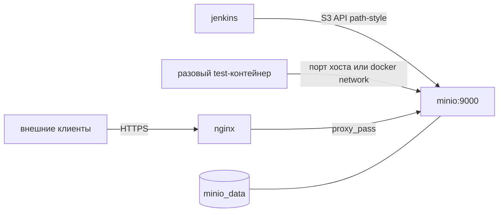

# План 01: MinIO в Docker Compose для Jenkins Artifact Manager on S3

## Цель

Развернуть MinIO в общем стеке `docker-compose.yml` как S3-совместимое хранилище для Jenkins: учётные данные, bucket, политика доступа и публичный HTTPS-endpoint, чтобы Jenkins мог хранить и удалять артефакты (`stash` / `unstash` через Artifact Manager on S3).

> Каталог `S3/` в репозитории **не использовать** — он занят сервисом `s3-sync` (rclone → Yandex Object Storage). Все файлы MinIO — только в каталоге **`minio/`**.

## Результат задачи

- Сервис `minio` добавлен в корневой `docker-compose.yml`, данные — в именованном volume `minio_data`.
- Публичный доступ к S3 API: **`https://s3.oscript.io`** (nginx → MinIO внутри сети compose).
- В `web/nginx/sites-enabled/` добавлен vhost для `s3.oscript.io`.
- В `init-letsencrypt.sh` добавлен поддомен `s3.oscript.io` (выпуск/обновление сертификата вместе с остальными доменами стека).
- Bucket `jenkins-artifacts`, сервисный пользователь MinIO для Jenkins, IAM-политика с минимальными правами.
- ILM (lifecycle): объекты старше **10 дней** удаляются автоматически, если Jenkins их не удалил.
- Bootstrap выполнен **один раз**; состояние (данные MinIO, пользователи, политики, ILM) сохраняется в `minio_data` и переживает пересоздание контейнера.
- Подготовлены значения для Jenkins (без коммита секретов): endpoint, access key, secret key, bucket, region.
- Разовый тестовый клиент (`minio/test/`) успешно проверил Put/Get/Delete под учёткой Jenkins.

---

## Архитектура



- MinIO **не** публикует API на хост напрямую (без `ports: 9000:9000`), если API отдаёт nginx. Для разового теста допустимо пробросить порт только на этапе проверки или подключать test-контейнер к той же docker-сети.
- Console MinIO (порт 9001) в проде не выставлять в интернет.

---

## Структура каталога `minio/`

```
minio/
  Dockerfile              # образ на базе minio/minio + копирование bootstrap-скрипта
  bootstrap.sh            # идемпотентная первичная настройка (см. ниже)
  policies/
    jenkins-artifacts.json
  .env.example            # MINIO_ROOT_*, JENKINS_S3_* — шаблон без секретов
  test/
    Dockerfile            # клиент minio/mc (или mc в alpine)
    smoke.sh              # put → get → delete под jenkins-пользователем
```

---

## Docker Compose

### Сервис `minio`

- `build: ./minio` (или `image` + монтирование скрипта — предпочтительно копировать `bootstrap.sh` в образ при сборке).
- `command: server /data --console-address ":9001"`.
- Volume: **`minio_data:/data`** (именованный volume в секции `volumes` корневого compose).
- `restart: always`.
- `healthcheck` (например `mc ready` или HTTP `/minio/health/live`).
- Переменные окружения root: `MINIO_ROOT_USER`, `MINIO_ROOT_PASSWORD` — из `.env` на сервере, не в git.

### Персистентность bootstrap

Скрипт `bootstrap.sh` копируется в образ (например `/usr/local/bin/bootstrap.sh`) и вызывается из **entrypoint/wrapper** перед `minio server`.

Логика скрипта (идемпотентность):

1. Дождаться готовности MinIO (локальный `mc alias` на `http://127.0.0.1:9000` или сокет).
2. Проверить маркер **`/data/.minio-bootstrap-done`** на том же volume, что и данные MinIO.
3. Если маркер есть — **выход без изменений** (пересоздание контейнера не повторяет настройку).
4. Если маркера нет — выполнить:
   - создать bucket `jenkins-artifacts` (если нет);
   - создать пользователя Jenkins, применить политику из `policies/jenkins-artifacts.json`;
   - применить ILM: **expiration 10 days** на bucket `jenkins-artifacts`;
   - записать маркер `/data/.minio-bootstrap-done`.
5. Запустить/передать управление основному процессу `minio server`.

Пользователи, политики и ILM хранятся в данных MinIO на volume; маркер гарантирует, что повторный запуск скрипта не ломает существующую конфигурацию.

---

## Nginx: `s3.oscript.io`

Добавить файл **`web/nginx/sites-enabled/s3.oscript.io`** по образцу `jenkins` / `hub.oscript.io`:

- `server_name s3.oscript.io`;
- HTTP → редирект на HTTPS, `/.well-known/acme-challenge/` для certbot;
- HTTPS: `ssl_certificate` / `ssl_certificate_key` для `s3.oscript.io`;
- `location /` → `proxy_pass http://minio:9000;` с заголовками `Host`, `X-Forwarded-Proto`, `X-Real-IP`;
- **`client_max_body_size`** — достаточный для крупных артефактов Jenkins;
- таймауты proxy (`connect` / `send` / `read`) — не ниже, чем у `build.oscript.io`, чтобы большие upload не обрывались.

Path-style URL для S3 сохраняется: nginx проксирует на корень MinIO, **не** подменяет Host на `bucket.s3.oscript.io`.

В `docker-compose.yml` у сервиса `nginx` в `depends_on` при необходимости добавить `minio`.

DNS: A/AAAA запись **`s3.oscript.io`** на хост со стеком (до запуска certbot).

---

## Let's Encrypt

В **`init-letsencrypt.sh`** в массив `domains` добавить **`s3.oscript.io`**:

```bash
domains=(api.oscript.io hub.oscript.io oscript.io build.oscript.io s3.oscript.io)
```

После добавления vhost и DNS — выполнить скрипт на сервере (или отдельный `certbot certonly` для нового домена по той же схеме, что в скрипте).

---

## Jenkins: Artifact Manager on S3

Настройки плагина (Manage Jenkins → AWS / Artifact Management):

| Параметр | Значение |
|----------|----------|
| Custom Endpoint | `https://s3.oscript.io` (внутри compose при отладке: `http://minio:9000`) |
| Bucket | `jenkins-artifacts` |
| Signing region | `us-east-1` |
| Use Path Style URL | **включить** |
| Disable session token | **включить** |

Учётные данные — access/secret **сервисного пользователя Jenkins**, не root MinIO.

Секреты передать владельцу Jenkins отдельно (password manager / `.env` на сервере). В репозиторий — только `.env.example`.

---

## Lifecycle (ILM)

Страховка от «забытых» объектов:

- правило на bucket `jenkins-artifacts`: **удаление объектов через 10 дней** после создания;
- настраивается в `bootstrap.sh` через `mc ilm rule add` (или эквивалент API);
- Jenkins по-прежнему должен удалять объекты сам; ILM — запасной механизм.

---

## Шаги для ИИ-агента

1. Создать каталог **`minio/`** (не `S3/`) со всеми артефактами из структуры выше.
2. `Dockerfile` для MinIO: базовый официальный образ `minio/minio`, в образ копировать `bootstrap.sh` и `policies/`.
3. Реализовать entrypoint: bootstrap → `minio server`.
4. Добавить сервис `minio` и volume **`minio_data`** в корневой `docker-compose.yml`.
5. Добавить **`web/nginx/sites-enabled/s3.oscript.io`**, обновить **`init-letsencrypt.sh`** (`s3.oscript.io` в `domains`).
6. Добавить **`minio/.env.example`** с перечнем переменных.
7. Развернуть на сервере: DNS → `docker compose up -d` → certbot при необходимости → проверить HTTPS.
8. Выполнить разовый тест (раздел «Тест»).
9. Передать владельцу Jenkins параметры подключения; проверить pipeline с артефактами / stash (в т.ч. отображение в UI build).

---

## Тест

Отдельный **разовый** тестовый клиент (не profile в compose):

1. Собрать образ из `minio/test/Dockerfile` (клиент `mc`).
2. Запустить контейнер вручную, подключив к сети стека или к проброшенному порту MinIO на хосте:
   ```bash
   docker build -t minio-smoke ./minio/test
   docker run --rm --network <сеть_compose> \
     -e MC_HOST_minio=http://<access>:<secret>@minio:9000 \
     minio-smoke /smoke.sh
   ```
3. `smoke.sh` под **учёткой Jenkins** (не root): загрузить файл в `jenkins-artifacts`, прочитать, удалить; ненулевой exit code при ошибке.

Опционально повторить с `--endpoint-url https://s3.oscript.io` через aws-cli для проверки цепочки nginx + TLS.

---

## Критерии успеха

- MinIO работает в compose, данные в **`minio_data`**, пересоздание контейнера **не** требует повторного bootstrap (маркер и данные на volume).
- `https://s3.oscript.io` отвечает, сертификат Let's Encrypt выпущен.
- Пользователь Jenkins: `Put` / `Get` / `Delete` в `jenkins-artifacts`.
- ILM: expiration **10 дней** применён.
- Политика доступа — минимально необходимая.
- Параметры для Jenkins переданы владельцу (без секретов в git).
- Разовый test-контейнер успешно выполнил put/get/delete под jenkins-пользователем.
